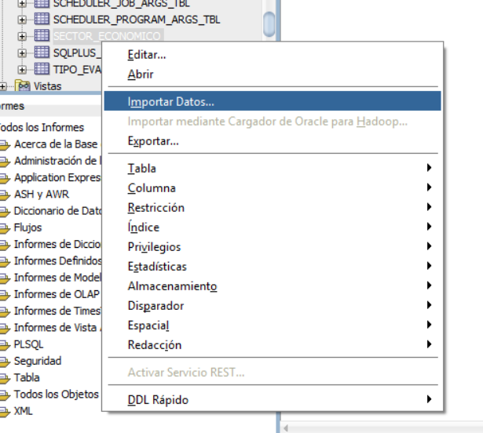
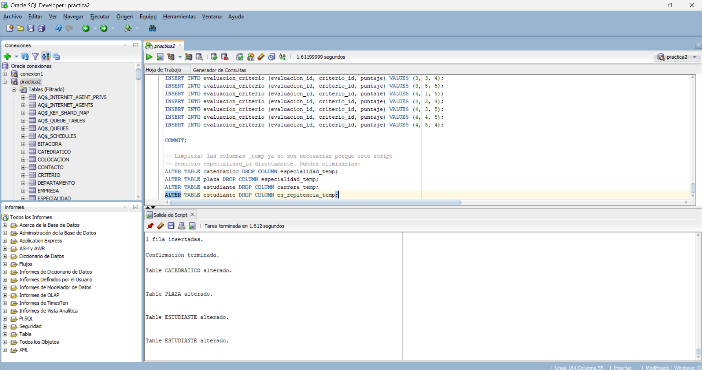
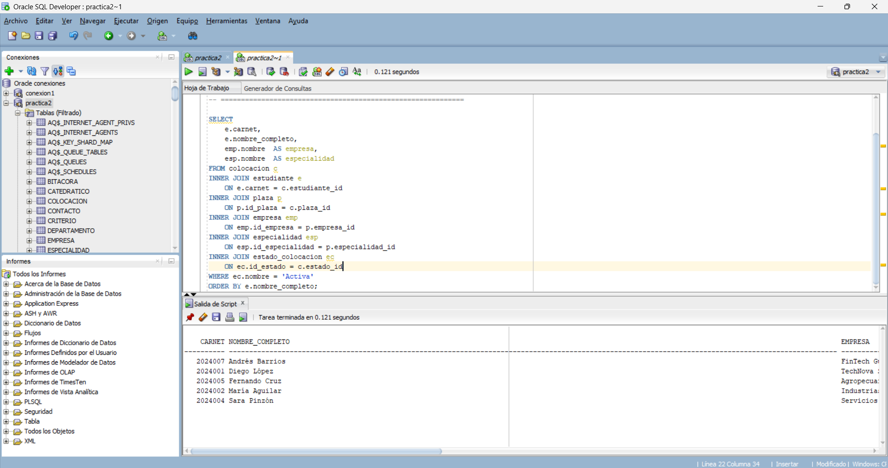

# Manual de Carga
## Práctica 2 — Auditoría Operativa del Programa de EPS

**Nombre:** Mynor Roberto López Díaz
**Carné:** 202305456

---

## 1. Objetivo

Este manual documenta el proceso seguido para poblar, mediante la importación de datos desde el archivo `Dataset_Practica2.xlsx`, el modelo relacional construido en la Práctica 1 y adaptado para esta segunda práctica, respetando en todo momento la integridad referencial (llaves primarias y foráneas) del esquema.

---

## 2. Adaptación del modelo relacional

El dataset proporcionado por la Dirección Académica trajo una estructura ligeramente distinta a la definida originalmente en la Práctica 1: incluía catálogos normalizados adicionales que no se habían modelado antes. Antes de importar, se ajustó el esquema para incorporar estos catálogos, conservando al mismo tiempo ciertas decisiones propias de la Práctica 1:

**Catálogos incorporados desde el dataset:**
- `sector_economico`
- `departamento`
- `municipio` (con llave foránea jerárquica hacia `departamento`)
- `estado_colocacion`
- `tipo_evaluacion`

**Decisiones propias conservadas de la Práctica 1:**
- Catálogo compartido `especialidad`, construido a partir de los valores únicos de texto encontrados en `PLAZA.ESPECIALIDAD_TECNICA`, `CATEDRATICO.ESPECIALIDAD` y `ESTUDIANTE.CARRERA_TECNICA` (el dataset no traía este catálogo explícito).
- Llave primaria natural `carnet` en la tabla `estudiante`, en lugar de un identificador sustituto.
- Atributo `primera_practica`, calculado como el inverso del campo `ES_REPITENCIA` del dataset (`primera_practica = 1 − es_repitencia`).

El script de creación del esquema adaptado (`DDL_Practica2.sql`) se ejecutó exitosamente sobre una conexión Oracle dedicada (`practica2`), independiente de la base usada en la Práctica 1, generando las 17 tablas del modelo con sus respectivas llaves primarias, foráneas y restricciones `CHECK`.

---

## 3. Orden de importación utilizado

Siguiendo la guía de dependencias entregada, y ajustándola para incluir el catálogo `especialidad`, se importó en el siguiente orden:

1. `sector_economico`
2. `departamento`
3. `estado_colocacion`
4. `tipo_evaluacion`
5. `criterio`
6. `instituto`
7. `especialidad` *(catálogo propio, no incluido en el dataset original)*
8. `municipio` *(depende de departamento)*
9. `empresa` *(depende de sector_economico)*
10. `contacto` *(depende de empresa)*
11. `catedratico` *(depende de instituto y especialidad)*
12. `estudiante` *(depende de municipio, instituto y especialidad)*
13. `plaza` *(depende de empresa, contacto y especialidad)*
14. `colocacion` *(depende de estudiante, plaza, catedrático y estado_colocacion)*
15. `bitacora` *(depende de colocación y contacto)*
16. `evaluacion` *(depende de colocación, catedrático y tipo_evaluacion)*
17. `evaluacion_criterio` *(depende de evaluación y criterio)*

---

## 4. Método de importación utilizado

Oracle SQL Developer ofrece un asistente gráfico de importación (`click derecho sobre la tabla → Importar Datos...`, ver Figura 1) que permite cargar un archivo Excel/CSV hoja por hoja, mapeando manualmente cada columna de origen a su columna destino.

*Figura 1. Opción "Importar Datos..." disponible desde el menú contextual de cada tabla en Oracle SQL Developer.*

Sin embargo, dado que el modelo consta de **17 tablas**, varias de ellas con columnas cuyo nombre no coincide directamente con el del archivo de origen (por ejemplo, `ID_SECTOR` → `sector_id`) y tres de ellas requiriendo además una transformación de texto libre a llave foránea (`especialidad_id`, resuelto contra el catálogo `especialidad`), repetir el proceso manual del asistente 17 veces habría sido lento y propenso a errores de mapeo.

**Por esta razón, se optó por generar un único script SQL con sentencias `INSERT`** construido directamente a partir de los datos del archivo `Dataset_Practica2.xlsx`, en lugar de usar el asistente gráfico tabla por tabla. Este script:

- Respeta el mismo orden de dependencia de llaves foráneas descrito en la sección 3.
- Resuelve directamente las columnas de texto libre (`ESPECIALIDAD_TECNICA`, `ESPECIALIDAD`, `CARRERA_TECNICA`) contra los identificadores del catálogo `especialidad` ya generado.
- Calcula `primera_practica` a partir de `ES_REPITENCIA`.
- Calcula el atributo `activo` de `colocacion` a partir del estado de la colocación (`'1'` si el estado es *Activa*, `'0'` en cualquier otro caso).
- Finaliza con un `COMMIT` y con la eliminación de las columnas temporales (`especialidad_temp`, `carrera_temp`, `es_repitencia_temp`) que se habían dejado en el esquema como puente para esta transformación.

El script se ejecutó como **Ejecutar Script (F5)** sobre la conexión `practica2`, insertando un total de 114 filas distribuidas en las 17 tablas, seguido de la confirmación (`COMMIT`) y la limpieza de columnas temporales.

*Figura 2. Salida de ejecución del script de importación, mostrando las últimas inserciones, la confirmación (`Confirmación terminada`) y las 4 sentencias `ALTER TABLE ... DROP COLUMN` de limpieza ejecutadas sin errores.*

---

## 5. Verificación de la carga

Tras la ejecución del script, se verificó la integridad de los datos mediante la ejecución de las 5 consultas de auditoría solicitadas (ver `Consulta1.sql` a `Consulta5.sql`), confirmando que las relaciones entre tablas —incluidas las transformaciones aplicadas (especialidad, primera_practica, activo)— se resolvieron correctamente.

### Ejemplo — Consulta 1: Directorio de Estudiantes Activos

*Figura 3. Resultado de la Consulta 1 (Directorio de Estudiantes Activos), mostrando carné, nombre, empresa y especialidad de los estudiantes con colocación en estado "Activa".*

---

## 6. Conclusiones

- El modelo relacional de la Práctica 1 se adaptó exitosamente para incorporar los catálogos normalizados requeridos por el dataset de la Práctica 2, sin perder las decisiones de diseño propias (especialidad compartida, carné como llave natural, primera_practica).
- La importación mediante script de `INSERT` generado a partir del archivo de origen resultó más eficiente y confiable que el uso del asistente gráfico tabla por tabla, evitando 17 iteraciones manuales de mapeo de columnas.
- La integridad referencial se mantuvo en todo momento: no se registraron errores de llave foránea durante la carga, gracias al orden de dependencia respetado.
