# Manual Técnico — Comercial La Estrella

Proyecto de base de datos relacional en Oracle. Incluye el modelo conceptual, el modelo lógico, el modelo relacional, las herramientas utilizadas, el orden de ejecución de los scripts, la justificación de normalización (1FN/2FN/3FN) y la evidencia de ejecución de la carga de datos y las consultas de reportes.

---

## 1. Modelos de datos

Los tres modelos se generaron en Oracle SQL Data Modeler (integrado en SQL Developer), a partir del diccionario de datos importado directamente del esquema ya creado en Oracle (*Archivo > Data Modeler > Importar > Diccionario de Datos*). Los tres son vistas del mismo diagrama con distinto nivel de detalle habilitado desde *Ver Detalles*: el conceptual muestra solo entidades y relaciones; el lógico agrega los atributos de cada entidad (sin tipos de dato); el relacional muestra la estructura física completa, con tipos de columna y las restricciones PK/FK/UNIQUE tal como quedaron creadas en la base de datos.

### 1.1 Modelo conceptual

Entidades y relaciones con su cardinalidad, sin atributos ni tipos de dato. Las relaciones 1:1 entre PERSONA-EMPLEADO y PERSONA-CLIENTE representan la especialización disjunta y total de persona en sus dos
subtipos (toda persona es empleado o cliente, nunca ambos); la herramienta no ofreció una notación de subtipo/ISA explícita en esta versión, por lo que se documenta aquí la semántica real de la relación.

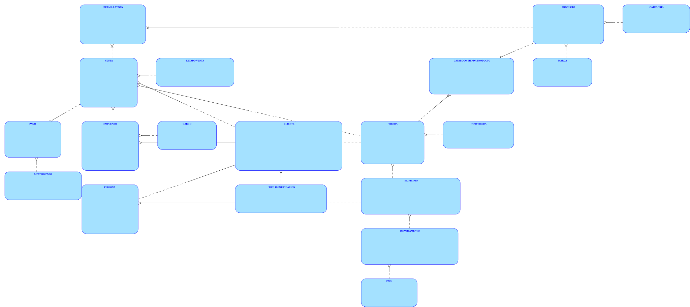

### 1.2 Modelo lógico

Mismas 19 entidades y relaciones, con sus atributos identificados por nombre y marcados como llave primaria (P) o restricción de unicidad (U), sin exponer aún los tipos de dato físicos.

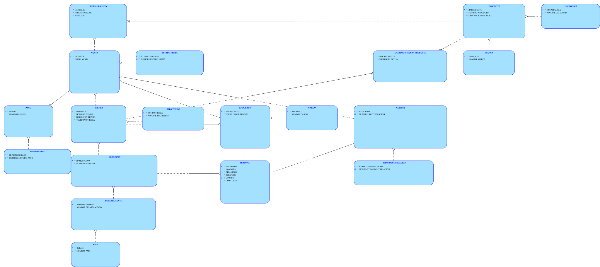

### 1.3 Modelo relacional

Estructura física completa tal como fue creada en el esquema **estrella**: nombres de columna, tipos de dato Oracle (NUMBER, VARCHAR2, DATE), y las restricciones PK, FK y UNIQUE de cada tabla, incluyendo las
dos llaves primarias compuestas del modelo (CATALOGO_TIENDA_PRODUCTO y DETALLE_VENTA).

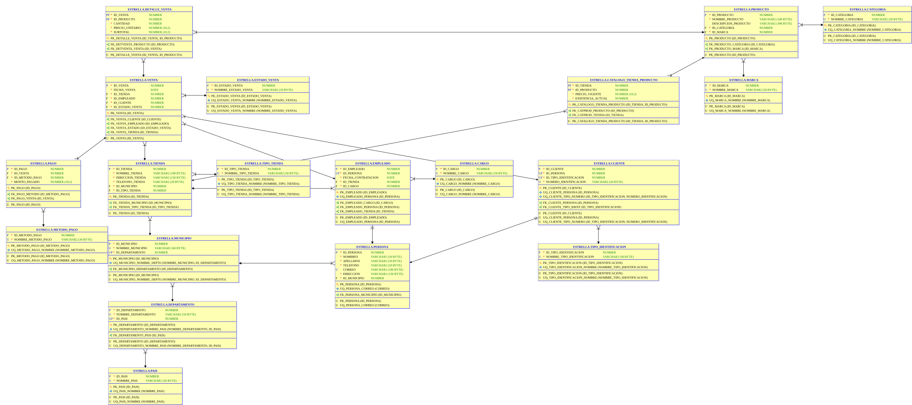

---

## 2. Herramientas utilizadas

- **Motor de base de datos:** Oracle Database XE 21c, imagen `gvenzl/oracle-xe:21-slim`, ejecutada en un contenedor Docker.
- **Cliente y modelado:** Oracle SQL Developer, incluyendo su módulo integrado Data Modeler, para la hoja de trabajo SQL, la ejecución de scripts y los tres diagramas de la sección 1.
- **Esquema de trabajo:** usuario/esquema dedicado `estrella`, creado específicamente para este proyecto (separado de otros esquemas de práctica del curso) para garantizar que el DDL se ejecuta contra una base vacía sin choques de nombres.
- **Python 3 + openpyxl:** script `generar_carga_datos.py` que lee el Excel de datos de prueba (`dataset_comercial_la_estrella.xlsx`) y genera el script SQL de carga de forma reproducible — si el Excel se modifica o se le agregan filas, basta con volver a correr el script para regenerar la carga.

---

## 3. Orden de ejecución de scripts

Todos los scripts se ejecutan sobre la conexión del esquema `estrella`, en el orden siguiente, usando *Ejecutar Script* (F5) en SQL Developer para los `.sql`:

1. **`03_creacion_DB.sql`** — Crea las 19 tablas del esquema desde cero (PK, FK, UNIQUE, CHECK). Se ejecuta una sola vez contra un esquema vacío.
2. **`generar_carga_datos.py`** — Se corre desde la terminal (`python generar_carga_datos.py`), colocado en la misma carpeta que el Excel de datos de prueba. Genera `carga_datos_prueba.sql` a partir del contenido actual del Excel.
3. **`carga_datos_prueba.sql`** — Se ejecuta en SQL Developer sobre el esquema estrella. Limpia las 19 tablas (DELETE en orden inverso de dependencias) y las vuelve a cargar por completo desde el Excel, para poder repetirse cualquier número de veces sin errores de llave duplicada. Al final resincroniza las secuencias IDENTITY de cada tabla con el máximo id actual.
4. **`04_Consulta1.sql` … `04_Consulta8.sql`** — Las ocho consultas de reportes, cada una en su propio archivo, numeradas y comentadas. Se ejecutan de forma independiente, en cualquier orden, una vez cargados los datos de prueba.

---

## 4. Justificación de la aplicación de 1FN, 2FN y 3FN

### Primera Forma Normal (1FN)

Todos los atributos del modelo son atómicos: ninguna columna almacena varios valores ni listas. El caso más ilustrativo es una venta con varios productos: en vez de guardar los productos de una venta en una sola celda o columna repetida, cada producto vendido es una fila independiente en `detalle_venta`, con su propia cantidad, precio unitario y subtotal. Lo mismo aplica a los pagos de una venta (una fila por pago en `pago`, no una lista de montos).

### Segunda Forma Normal (2FN)

Todo atributo no clave depende de la llave primaria completa, no de una parte de ella. Esto es relevante en las dos entidades con llave primaria compuesta del modelo:

- **catalogo_tienda_producto** (PK: id_tienda + id_producto): precio_vigente y existencia_actual dependen de la combinación tienda-producto, no de una sola parte. Por eso no viven como atributos de producto — si lo hicieran, no se podría representar que el mismo producto tiene precio y existencia distintos en cada tienda, que es justamente el caso real en los datos de prueba.
- **detalle_venta** (PK: id_venta + id_producto): cantidad, precio_unitario y subtotal dependen de la combinación venta-producto. precio_unitario en particular es intencionalmente independiente del precio_vigente del catálogo: congela el valor aplicado al momento de la venta, que no cambia aunque el precio del producto cambie después.

### Tercera Forma Normal (3FN)

Ningún atributo no clave depende de otro atributo no clave (sin dependencias transitivas). Ejemplo directo: `tienda` solo almacena id_municipio, no el nombre del departamento ni del país aunque técnicamente se podrían derivar siguiendo la cadena tienda → municipio → departamento → país. Guardarlos directamente en tienda crearía una dependencia transitiva y el riesgo de inconsistencia si el nombre de un departamento cambia. El mismo patrón se aplica en `producto` (solo id_categoria e id_marca, no sus nombres) y en `persona` (solo id_municipio de residencia).

### Nota sobre el supertipo persona

Separar los atributos comunes a empleado y cliente (nombres, apellidos, teléfono, correo, dirección, municipio) en una entidad `persona` compartida evita que ambas los repitan por separado, y de paso permite declarar la restricción de correo único una sola vez para el universo combinado de personas, en lugar de dos restricciones independientes que no se validarían entre sí.

---

## 5. Evidencia de ejecución

### 5.1 Carga de datos

Generación del script de carga a partir del Excel de datos de prueba, mostrando el conteo de filas leídas por cada una de las 19 hojas:

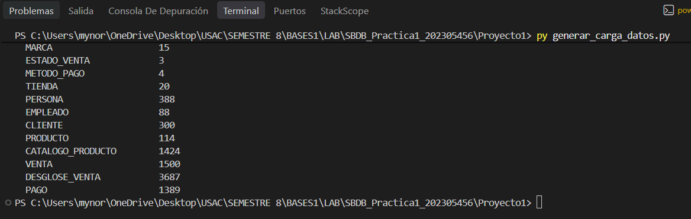

Resincronización final de las secuencias IDENTITY al terminar la carga, con las 19 tablas ya visibles y pobladas en el esquema estrella:

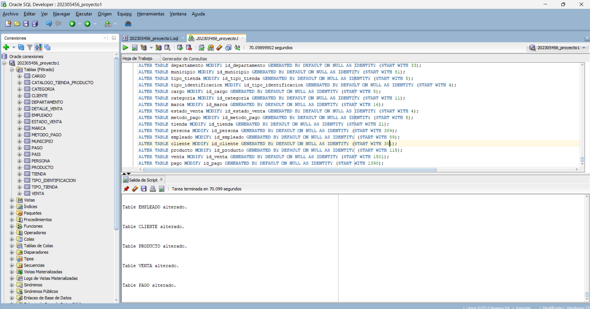

### 5.2 Consultas de reportes

Evidencia de ejecución de las 8 consultas requeridas, cada una desde su archivo `04_ConsultaN.sql` correspondiente, ejecutadas contra los datos de prueba ya cargados.

#### Consulta 1 — Ventas por tienda y ubicación

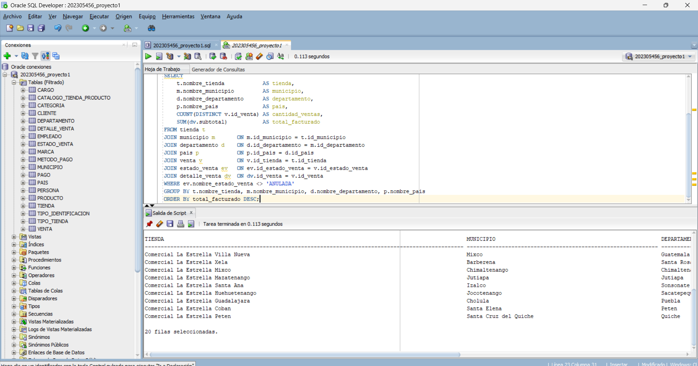

#### Consulta 2 — Ventas por tipo de tienda

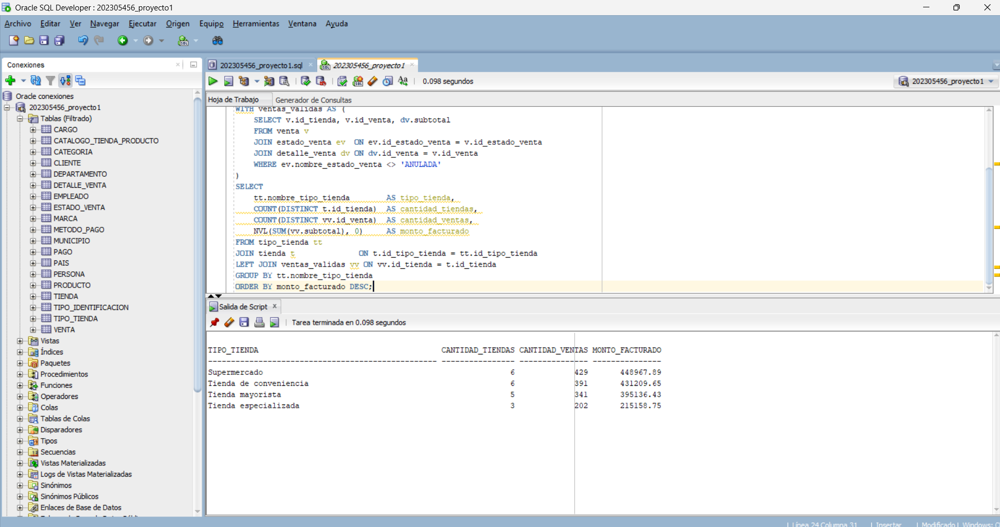

#### Consulta 3 — Productos más vendidos

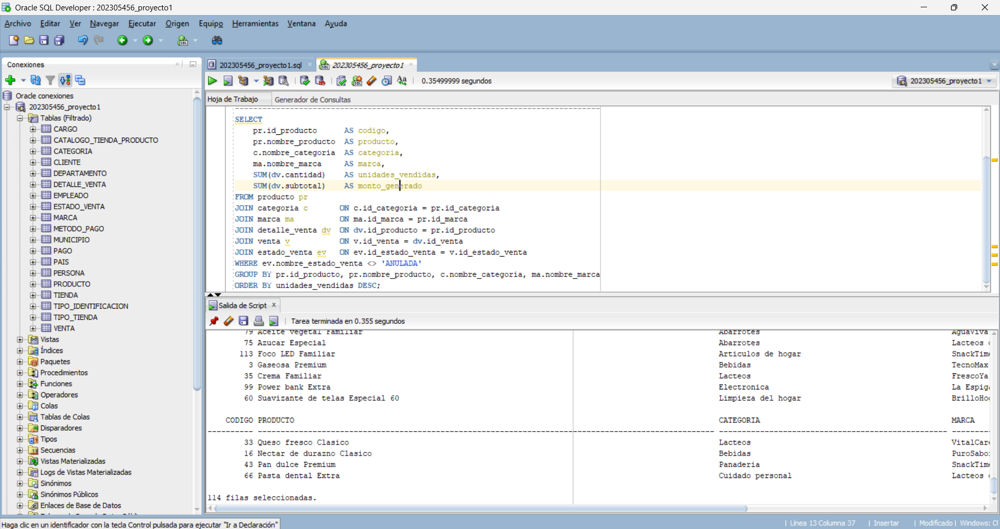

#### Consulta 4 — Desempeño de empleados

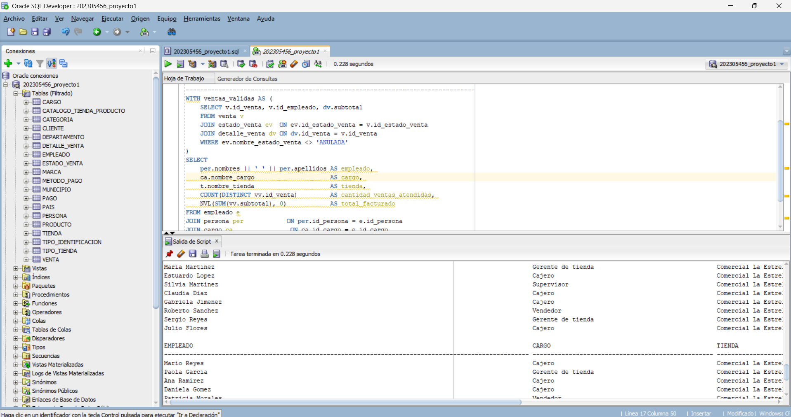

#### Consulta 5 — Clientes con mayor compra

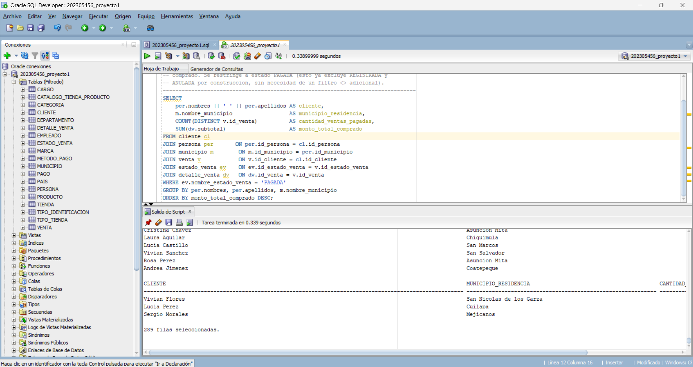

#### Consulta 6 — Facturación por categoría y marca

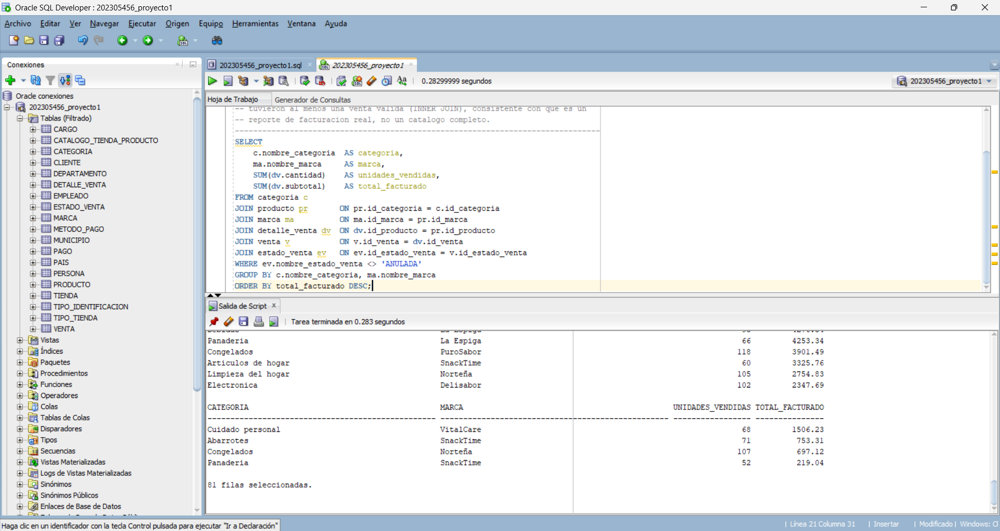

#### Consulta 7 — Uso de métodos de pago

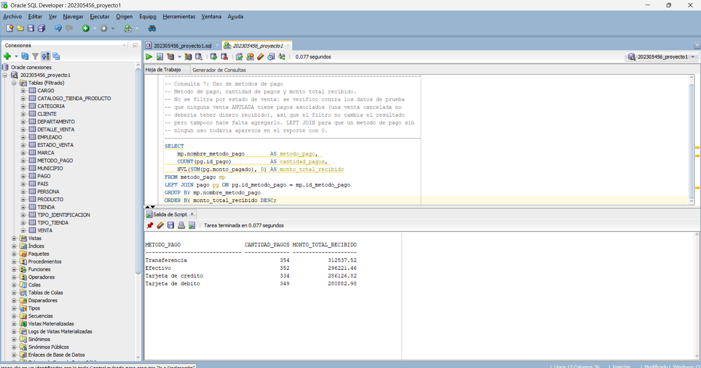

#### Consulta 8 — Ventas pendientes de pago

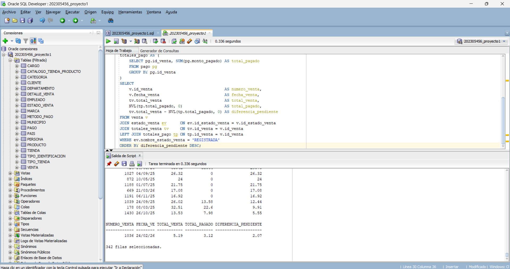
