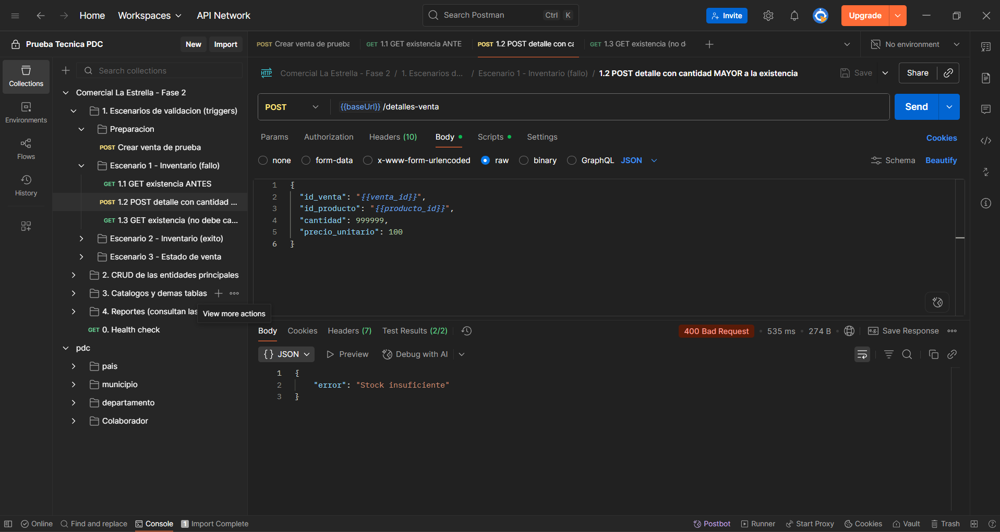
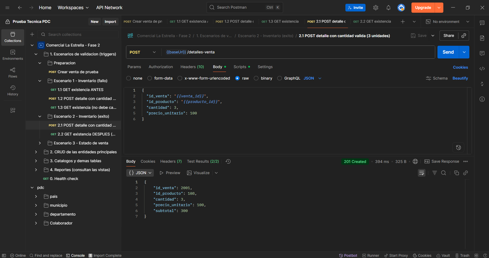
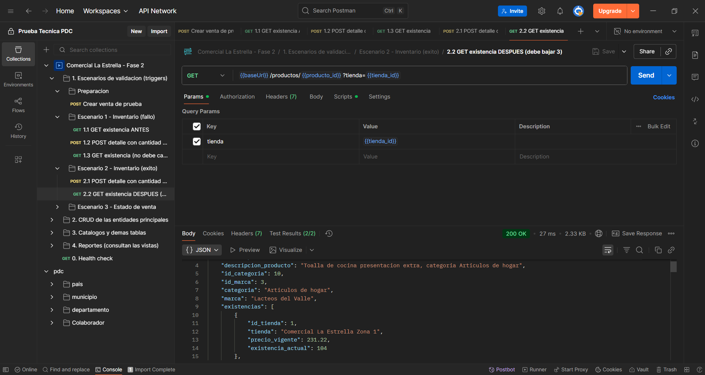
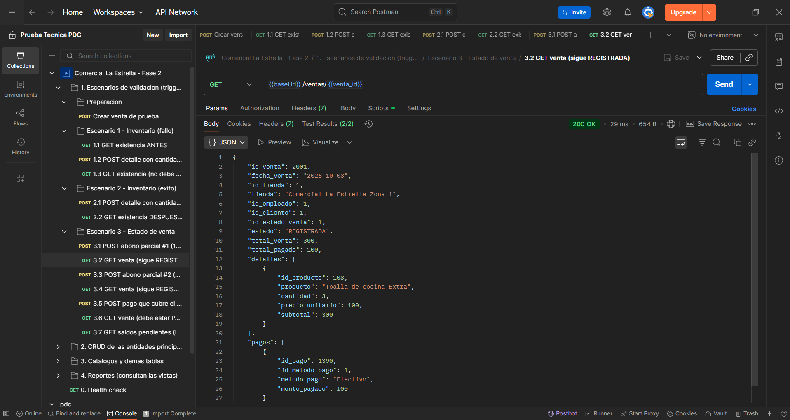
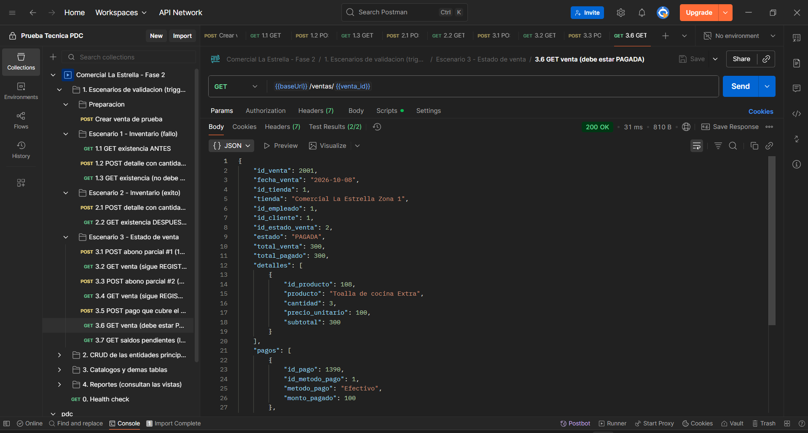

# Comercial La Estrella — Fase 2

Backend de Comercial La Estrella: **SQL Server 2022 en Docker** (con triggers y vistas en T-SQL) y un **API REST en Node.js + Express** que es la única vía para manipular los datos.

- Carné: 202305456
- Curso: Bases de Datos 1 — Proyecto Fase 2

## Contenido del proyecto

```
docker-compose.yml        SQL Server 2022 + servicio que ejecuta init.sql
init.sql                  tablas, llaves, datos iniciales, vistas y triggers
.env                      contraseña y puertos (la usan docker-compose y la API)
api/                      código del API REST (package.json, src/…)
postman/                  colección de Postman exportada (.json)
herramientas/             generador de init.sql a partir del Excel del dataset
capturas/                 evidencia del funcionamiento de los triggers
```

## Requisitos previos

| Herramienta | Notas |
|---|---|
| Docker Desktop | En ejecución (ícono de la ballena sin errores) |
| Node.js 18.19 o superior | Verificar con `node -v` |
| Postman | Para importar la colección |
| DBeaver | Solo para **verificar la estructura (solo lectura)** |

Puertos libres: **1433** (SQL Server) y **3000** (API).

## Paso 1 — Levantar SQL Server

Desde la carpeta raíz del proyecto (donde está `docker-compose.yml`):

```bash
docker compose up -d
```

La primera vez descarga la imagen de SQL Server (≈1.5 GB) y puede tardar unos minutos. Se crean dos contenedores:

- `estrella-sqlserver`: el motor de base de datos.
- `estrella-db-init`: espera a que el motor esté listo, ejecuta `init.sql` y termina.

## Paso 2 — Comprobar que la inicialización terminó

```bash
docker compose logs db-init
```

Debe terminar con:

```
Ejecutando init.sql (tablas, datos, vistas y triggers)...
init.sql completado correctamente.
```

Si dice que la base ya está inicializada, también es correcto (significa que ya se había creado antes). Para borrar todo y empezar de cero:

```bash
docker compose down -v
docker compose up -d
```

## Paso 3 — Conectar DBeaver (solo lectura)

1. *Nueva conexión* → **SQL Server**.
2. Datos de la pestaña *Principal*:
   - Host: `localhost` — Puerto: `1433`
   - Base de datos: `ComercialLaEstrella`
   - Autenticación: *SQL Server Authentication*
   - Usuario: `sa` — Contraseña: `Estrella2026!`
3. Pestaña **Propiedades del driver** → agregar/poner `trustServerCertificate` = `true` (el contenedor usa un certificado autofirmado; sin esto DBeaver muestra un error SSL).
4. Pestaña *General* → marcar **Read-only connection** (el enunciado limita DBeaver a verificación estructural).
5. *Probar conexión* (la primera vez DBeaver ofrece descargar el driver: aceptar) y *Finalizar*.

## Paso 4 — Verificación estructural (consultas de solo lectura)

Ejecutar en DBeaver sobre `ComercialLaEstrella`:

```sql
SELECT COUNT(*) AS tablas FROM sys.tables;                                  -- 19
SELECT name AS vista FROM sys.views ORDER BY name;                          -- 3 vistas
SELECT name AS trigger_, OBJECT_NAME(parent_id) AS tabla FROM sys.triggers; -- 2 triggers

SELECT 'persona' AS tabla, COUNT(*) AS filas FROM dbo.persona               -- 388
UNION ALL SELECT 'venta', COUNT(*) FROM dbo.venta                           -- 1500
UNION ALL SELECT 'detalle_venta', COUNT(*) FROM dbo.detalle_venta           -- 3687
UNION ALL SELECT 'pago', COUNT(*) FROM dbo.pago;                            -- 1389
```

Vistas e inventario (también solo lectura):

```sql
SELECT * FROM dbo.Vista_Ventas_Ubicacion ORDER BY total_facturado DESC;
SELECT * FROM dbo.Vista_Top_Productos ORDER BY unidades_vendidas DESC;
SELECT * FROM dbo.Vista_Saldos_Pendientes ORDER BY saldo_pendiente DESC;
SELECT * FROM dbo.catalogo_tienda_producto WHERE id_tienda = 1 AND id_producto = 108;
```

## Paso 5 — Levantar el API REST

```bash
cd api
npm install
npm start
```

Debe mostrar `API escuchando en http://localhost:3000/api` y `Conectado a SQL Server.` Comprobar en el navegador o en Postman:

```
GET http://localhost:3000/api/health      →  {"estado":"ok","base_de_datos":"ComercialLaEstrella"}
```

## Paso 6 — Pruebas con Postman

1. *Import* → seleccionar `postman/ComercialLaEstrella.postman_collection.json`.
2. Con el API corriendo, abrir la colección → **Run** (Collection Runner) → ejecutar en orden. Cada petición lleva pruebas automáticas (`pm.test`).
3. La carpeta **1. Escenarios de validación (triggers)** es la que demuestra el enunciado:

| Escenario | Qué hace | Resultado esperado |
|---|---|---|
| 1 — Inventario (fallo) | POST de un detalle con cantidad mayor a la existencia | **HTTP 400** con `"error": "Stock insuficiente"`; la existencia no cambia |
| 2 — Inventario (éxito) | POST de un detalle con cantidad válida (3 unidades) y luego GET del producto | **HTTP 201**; la existencia baja exactamente 3 |
| 3 — Estado de venta | Tres POST de pagos de 100 sobre una venta de 300 y GET de la venta después de cada uno | Sigue `REGISTRADA` tras el 1.º y el 2.º; pasa a **`PAGADA`** tras el 3.º (lo hace el motor) |

Cada corrida crea una venta nueva y consume 3 unidades de stock del producto de prueba. Para volver al estado original: `docker compose down -v` y `docker compose up -d`.

## Evidencia del funcionamiento de los triggers

Capturas de Postman (petición + respuesta) guardadas en `capturas/`:

**Escenario 1 — Stock insuficiente (HTTP 400)**



**Escenario 2 — Compra válida y existencia reducida**




**Escenario 3 — Venta que pasa a PAGADA**




## Endpoints

Todas las tablas tienen CRUD completo: `GET /` (listado), `GET /:id`, `POST /`, `PUT /:id`, `DELETE /:id`. Todo en JSON.

| Ruta base (`/api/…`) | Tabla(s) | Notas |
|---|---|---|
| `clientes`, `empleados` | `persona` + `cliente` / `empleado` | Crear, actualizar y borrar tocan ambas tablas en una transacción |
| `productos` | `producto` | `GET /:id` incluye `existencias` por tienda; con `?tienda=ID` agrega `existencia_actual` y `precio_vigente` de esa tienda |
| `tiendas`, `personas` | `tienda`, `persona` | |
| `ventas` | `venta` | Incluye estado, `total_venta` y `total_pagado`; `GET /:id` trae detalles y pagos. `DELETE` es **lógico** (pasa a `ANULADA`) |
| `detalles-venta` | `detalle_venta` | Llave compuesta: `/detalles-venta/:id_venta/:id_producto`. Si no se envía `precio_unitario` usa el precio vigente de la tienda. Dispara `Insert_Detalle` |
| `pagos` | `pago` | Dispara `Insert_Pago` |
| `catalogo` | `catalogo_tienda_producto` | Llave compuesta: `/catalogo/:id_tienda/:id_producto` |
| `paises`, `departamentos`, `municipios`, `tipos-tienda`, `tipos-identificacion`, `cargos`, `categorias`, `marcas`, `estados-venta`, `metodos-pago` | catálogos | CRUD genérico |
| `reportes/ventas-ubicacion` | `Vista_Ventas_Ubicacion` | Solo `SELECT` sobre la vista |
| `reportes/top-productos` | `Vista_Top_Productos` | |
| `reportes/saldos-pendientes` | `Vista_Saldos_Pendientes` | |

Errores: `400` datos inválidos o trigger (`Stock insuficiente`), `404` no existe, `409` duplicado o registro referenciado por otros, `503` sin conexión a la base.

## Decisiones de diseño

- **El stock es por tienda.** Se conserva el modelo aprobado en la Fase 1: `existencia_actual` y `precio_vigente` viven en `catalogo_tienda_producto`. El trigger `Insert_Detalle` valida y descuenta el stock de la tienda donde se registró la venta. Si el producto no está en el catálogo de esa tienda, se rechaza con otro error.
- **Los datos iniciales** del dataset se cargan dentro de `init.sql` **antes** de crear los triggers; así el histórico no altera el inventario.
- **`subtotal`** es una columna calculada y persistida (`cantidad × precio_unitario`): el motor garantiza la regla.
- **Diferencias frente a Oracle:** `UNIQUE(correo)` pasa a un índice único filtrado (SQL Server solo admite un NULL por columna); `fecha_contratacion <= hoy` ahora sí es un `CHECK` (`GETDATE()` está permitido).
- **Las vistas** no llevan `ORDER BY` (no se permite en T-SQL); el orden lo aplica cada endpoint.
- **Los triggers** trabajan por conjuntos sobre `inserted` (SQL Server dispara una vez por sentencia, no por fila). Los errores usan números propios (`50001`, `50002`) que la API traduce a HTTP.

## Limitaciones conocidas

- El enunciado solo pide triggers de `INSERT`: un `PUT` o `DELETE` sobre `detalle_venta` **no** devuelve ni ajusta el inventario, y anular una venta tampoco repone el stock.
- La regla «el empleado debe pertenecer a la tienda de la venta» no está forzada por el motor (no se pidió); los datos del dataset y de la colección la respetan.

## Regenerar init.sql desde el Excel

Si cambia el dataset: colocar el Excel en `herramientas/` con el nombre `dataset_comercial_la_estrella.xlsx` y ejecutar:

```bash
pip install openpyxl
python herramientas/generar_init.py
docker compose down -v
docker compose up -d
```

## Problemas frecuentes

| Síntoma | Causa / solución |
|---|---|
| `db-init` termina con error | Ver `docker compose logs db-init`; corregir y repetir con `docker compose down -v` y `docker compose up -d` |
| DBeaver: error SSL / `PKIX path building failed` | Falta `trustServerCertificate=true` en las propiedades del driver |
| La API responde `503` | El contenedor aún no está listo o no está arriba: `docker compose ps` |
| `npm start` falla al iniciar | Revisar la versión de Node (`node -v`, se requiere 18.19+) y haber ejecutado `npm install` |
| Puerto 1433 o 3000 ocupado | Cerrar el programa que lo usa o cambiar el puerto en `docker-compose.yml` / `.env` |
